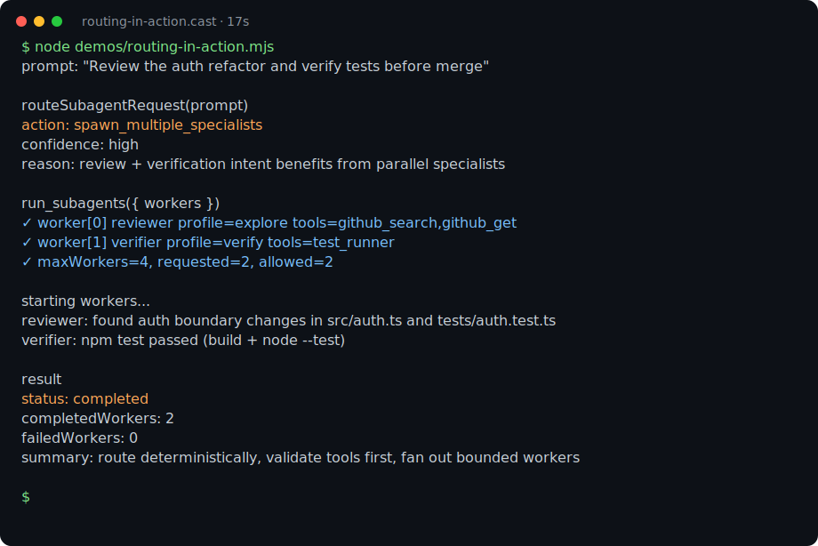
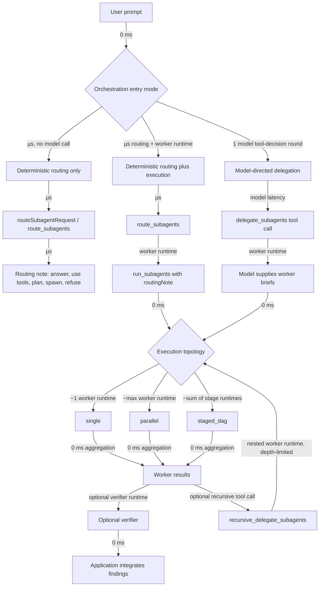

# @5queezer/tanstack-ai-subagents

Reusable subagent routing and execution helpers for TanStack AI applications.

Use it when one assistant needs to decide whether to answer directly, use tools, write a plan, or delegate bounded work to one or more specialist workers.



[Raw asciinema cast](demo/routing-in-action.cast)

## Why

TanStack AI gives you model and tool primitives. This package adds a small orchestration layer for applications that want focused worker fanout without giving up control over models, tools, validation, or UI.

The core opinion: **LLM-as-router is the wrong default for finite routing decisions.** When the route set is known, routing should be fast, deterministic, cheap, and testable.

This package supports three orchestration entry modes:

1. **Deterministic routing** — call `routeSubagentRequest(...)` or `route_subagents` to classify intent without an LLM.
2. **Deterministic routing plus execution** — call `route_subagents`, then `run_subagents` with the resulting routing note for auditable worker execution. This is the most advanced/auditable path when paired with `staged_dag` topology and a verifier.
3. **Model-directed delegation** — expose `delegate_subagents` and let the model choose bounded workers through normal tool calling.

Worker execution then uses one of three topologies: `single`, `parallel`, or `staged_dag`.



Use deterministic routing for production paths with known intents. Use deterministic routing plus `staged_dag` execution and a verifier when you need the strongest control, auditability, and validation. Use model-directed delegation when open-ended context, provider-native tool calling, or conversational flexibility is more valuable than repeatability.

## Features

- Deterministic score-based routing with `routeSubagentRequest(...)`
- TanStack AI tool factories for `route_subagents`, `run_subagents`, `delegate_subagents`, and `recursive_delegate_subagents`
- Bounded worker validation with configurable `maxWorkers`, `maxConcurrency`, and `policy.maxToolsPerWorker`
- Optional runtime tool selection for workers from application-provided registries, including MCP/OpenAPI-loaded tools
- Research-aligned delegation contracts: worker authority, risk, verification criteria, and dependencies
- Parallel and staged-DAG worker execution with topology metadata
- Configurable dependency-failure handling: skip dependents, abort, or continue
- Output validation for required markdown sections and simple required JSON fields
- Worker retry policy plus aggregate cost/token/turn budget guards
- Package-managed recursive delegation with nested run provenance and depth limits
- Trace summaries for task/stage events
- Optional verifier callbacks before integration
- Repair-task planning helpers for failed verifier results
- Run-history listing/formatting helpers for persisted subagent run records
- Consumer-defined tool registries and worker profiles
- Per-worker lifecycle callbacks
- Background run handles with `startSubagents(...)`
- Provider-agnostic model adapter injection

## Installation

```bash
npm install @5queezer/tanstack-ai-subagents @tanstack/ai zod
```

`@tanstack/ai` and `zod` are peer dependencies. This is not an official TanStack package.

Requirements:

- Node.js `>=18`
- ESM project or compatible bundler/runtime

## Quick start

This example runs deterministic routing, then executes workers with a fake runner. Real applications usually pass TanStack AI `chat`, a model adapter, and concrete tools instead.

```ts
import { routeSubagentRequest, runSubagents } from '@5queezer/tanstack-ai-subagents'

const routingNote = routeSubagentRequest('Review frontend and backend independently')

const result = await runSubagents({
  originalPrompt: 'Review frontend and backend independently',
  routingNote,
  workers: [
    worker('frontend', 'Review frontend code'),
    worker('backend', 'Review backend code'),
  ],
}, {
  tools: { repo_read: { name: 'repo_read' } },
  runner: async (brief) => ({
    name: brief.name,
    status: 'completed',
    output: `${brief.name}: no issues found`,
  }),
})

console.log(result.action)   // 'spawn_multiple_specialists'
console.log(result.topology) // 'parallel'

function worker(name: string, objective: string) {
  return {
    name,
    objective,
    scope: 'read-only repository inspection',
    nonGoals: 'Do not edit files',
    toolNames: ['repo_read'],
    expectedOutput: 'Concise findings with evidence',
  }
}
```

Runnable examples are in [`examples/`](examples/):

```bash
npm run build
node examples/01-deterministic-routing.mjs
node examples/02-route-then-run.mjs
node examples/03-delegate-subagents-tool.mjs
node examples/04-staged-dag-with-verification.mjs
node examples/05-recursive-delegation.mjs
```

### Process-backed workers

Use `createProcessWorkerRunner(...)` when workers should run in isolated OS processes instead of the in-process TanStack AI chat adapter. The runner sends `{ brief, input }` as JSON on stdin by default, captures stdout/stderr, converts non-zero exits to failed worker results, and streams chunks through `onWorkerUpdate`.

```ts
import { createProcessWorkerRunner, runSubagents } from '@5queezer/tanstack-ai-subagents'

const runner = createProcessWorkerRunner({
  command: 'node',
  args: ['worker.js'],
  timeoutMs: 30_000,
})

const result = await runSubagents(input, {
  tools,
  runner,
  onWorkerUpdate: (update, brief) => {
    console.log(`[${brief.name}] ${update.stream}: ${update.chunk}`)
  },
})
```

## Usage

### 1. Deterministic routing

`routeSubagentRequest(...)` returns a structured routing note. The default router uses dependency-free intent scoring instead of an LLM call.

```ts
import { routeSubagentRequest } from '@5queezer/tanstack-ai-subagents'

const note = routeSubagentRequest('Debug frontend and backend independently')

console.log(note.chosenAction) // 'spawn_multiple_specialists'
console.log(note.rationale)
```

Customize the router when your app has domain-specific vocabulary:

```ts
import { createSubagentRouter } from '@5queezer/tanstack-ai-subagents'

const route = createSubagentRouter({
  intents: {
    incident: ['incident', 'outage', 'sev1'],
    security: ['oauth', 'permission', 'vulnerability'],
  },
  highRiskTerms: ['pci', 'production database'],
  parallelTerms: ['ios', 'android'],
  areaTerms: ['frontend', 'backend', 'mobile'],
})

const note = route('Investigate sev1 across ios and android')
```

### 2. TanStack AI tools

Expose deterministic routing and execution as tools:

```ts
import { chat } from '@tanstack/ai'
import {
  createRunSubagentsTool,
  createSubagentRouterTool,
} from '@5queezer/tanstack-ai-subagents'

import { getChatModel } from './ai-provider'
import { githubGet, githubSearch } from './tools'

const tools = {
  github_search: githubSearch,
  github_get: githubGet,
}

const profiles = {
  explore: {
    toolNames: ['github_search', 'github_get'],
    systemPrompt: 'Explore the assigned task and return concise findings with evidence.',
  },
}

export const serverTools = [
  createSubagentRouterTool(),
  createRunSubagentsTool({
    chat,
    getAdapter: getChatModel,
    tools,
    profiles,
  }),
]
```

### 3. Model-directed delegation

If you want the model to choose workers through normal tool calling, expose `delegate_subagents`. The package still validates worker count, tool access, profiles, dependencies, and delegation policy.

```ts
import { createDelegateSubagentsTool } from '@5queezer/tanstack-ai-subagents'

export const serverTools = [
  createDelegateSubagentsTool({
    chat,
    getAdapter: getChatModel,
    tools,
    profiles,
    maxWorkers: 4,
  }),
]
```

### 4. Recursive delegation

Use `recursive_delegate_subagents` when a worker is allowed to delegate nested bounded work. The package tracks nested run provenance and enforces `policy.maxRecursiveDepth`.

```ts
import { createRecursiveDelegateSubagentsTool } from '@5queezer/tanstack-ai-subagents'

const recursiveDelegate = createRecursiveDelegateSubagentsTool({
  chat,
  getAdapter: getChatModel,
  tools,
  profiles,
  policy: { maxRecursiveDepth: 2 },
  recursiveContext: parentInput.recursiveContext,
})
```

Recursive results are attached to the parent result as `childRuns`, with `runId`, `parentRunId`, `rootRunId`, and `depth` metadata.

## Delegation contracts

Each worker brief is a lightweight contract. The package validates contracts before any worker runs.

```ts
{
  name: 'release-verifier',
  objective: 'Check whether findings support release',
  dependsOn: ['implementation', 'tests'],
  scope: 'worker outputs and validation evidence',
  nonGoals: 'Do not publish or mutate state',
  toolNames: ['repo_read'],
  authority: 'read_only',
  risk: 'medium',
  verificationCriteria: 'Release recommendation follows from worker evidence',
  expectedOutput: 'Release recommendation with caveats',
}
```

Validation includes:

- `spawn_one_specialist` requires exactly one worker.
- `spawn_multiple_specialists` requires two or more workers.
- `maxConcurrency` limits how many ready workers run at once.
- Worker names must be unique.
- Workers can specify `toolNames`, use a `profile`, or rely on `toolSelector` when configured.
- Requested or selected tools must exist in the configured tool registry.
- Each worker may use at most `policy.maxToolsPerWorker` tools; default is `5`.
- `dependsOn` entries must reference known workers.
- Dependency cycles are rejected.
- Dependency depth is capped by `policy.maxDepth`; default is `4`.
- `external_side_effect` authority requires `policy: { riskTolerance: 'high' }`.
- `policy.onWorkerFailure` controls dependency behavior: `skip_dependents` (default), `abort`, or `continue`.
- `policy.maxRetries` retries transient worker failures; default is `1` attempt.
- `policy.maxCost`, `policy.maxTokens`, and `policy.maxTurns` enforce aggregate usage budgets when worker results report `usage`.

Workers without dependencies run in parallel. Workers with `dependsOn` run as a staged DAG. Results include `topology: 'single' | 'parallel' | 'staged_dag'` plus a lightweight `trace` summary of stage/task events. Set `maxConcurrency` to cap how many workers in a parallel stage may run at once; by default each stage may run up to `maxWorkers` workers.

For maximum control and auditability, use deterministic routing plus `staged_dag` workers and a `verifier`. This path captures the routing rationale, enforces worker contracts, preserves dependency order, and records verification before your application integrates the findings.

Recursive delegation is first-class when workers use `recursive_delegate_subagents`. The package records nested `childRuns`, assigns `runId` / `parentRunId` / `rootRunId`, tracks `depth`, and enforces `policy.maxRecursiveDepth`. Manual recursion is still possible if your application exposes ordinary `run_subagents` or `delegate_subagents` tools to workers, but those manual calls do not get package-managed recursive provenance unless they pass the inherited `recursiveContext`.

## Output validation and verification

Workers can request lightweight output validation before their result is accepted:

```ts
{
  name: 'release-verifier',
  objective: 'Check release evidence',
  scope: 'worker outputs',
  nonGoals: 'Do not mutate state',
  toolNames: ['repo_read'],
  expectedOutput: 'Markdown report with evidence',
  expectedSections: ['Summary', 'Evidence'],
}
```

For machine-readable outputs, set `jsonSchema: { required: ['fieldName'] }` to require valid JSON with the listed top-level fields. Failed validation turns that worker result into `status: 'failed'` with the validation error.

Use `verifier` when delegated work must be checked before integration.

```ts
const result = await runSubagents(input, {
  tools,
  policy: { requireVerification: true, maxDepth: 3 },
  runner,
  verifier: async (runResult) => ({
    status: 'verified',
    summary: `Checked ${runResult.workers.length} workers`,
    checkedWorkers: runResult.workers.map((worker) => worker.name),
  }),
})

console.log(result.verification?.status)
```

If `policy.requireVerification` is true and no verifier is configured, the result includes `verification.status === 'needs_review'`.

If a verifier worker or verifier callback fails in your application flow, `planVerifierRepairTasks(...)` can turn the failure plus prior worker outputs into bounded follow-up repair tasks.

## Tools and profiles

The package does not ship concrete worker tools. Applications provide a registry and workers reference tools by name:

```ts
const tools = {
  github_search: githubSearch,
  github_get: githubGet,
}
```

Profiles define reusable worker capabilities:

```ts
const profiles = {
  verify: {
    toolNames: ['test_runner'],
    systemPrompt: 'Verify the assigned task and report exact commands and evidence.',
    model: 'provider/verification-model',
  },
}
```

A worker can use `profile: 'verify'` instead of listing `toolNames` directly.

For runtime-loaded registries, such as MCP servers generated from `openapi.json`, provide a `toolSelector`. The selector runs before validation for workers without `toolNames` or `profile`, receives the current runtime catalog, and must return a bounded subset of tool names:

```ts
const result = await runSubagents(input, {
  chat,
  getAdapter,
  tools: mcpTools,
  policy: { maxToolsPerWorker: 5 },
  toolSelector: async ({ worker, availableTools, maxTools }) => {
    // Use deterministic matching, embeddings, or an LLM planner here.
    // Always return names from availableTools and no more than maxTools.
    return chooseRelevantTools(worker, availableTools).slice(0, maxTools)
  },
})
```

Resolution order is explicit `worker.toolNames`, then `worker.profile`, then `toolSelector`. The orchestrator validates the final names against the registry and cap before workers run.

## Background runs

`startSubagents(...)` starts orchestration and returns a handle immediately:

```ts
import { startSubagents } from '@5queezer/tanstack-ai-subagents'

const handle = startSubagents(input, options)

console.log(handle.runId, handle.status) // running
const result = await handle.result
console.log(handle.status) // completed or failed
```

## API

```ts
createSubagentRouter(config?)
createSubagentRouterTool(options?)
createRunSubagentsTool(options)
createDelegateSubagentsTool(options)
createRecursiveDelegateSubagentsTool(options)
routeSubagentRequest(prompt)
runSubagents(input, options)
startSubagents(input, options)
validateRunSubagentsInput(input, options)
```

Key exported types:

```ts
SubagentAction
SubagentRouter
SubagentRouterConfig
SubagentRoutingNote
SubagentWorkerBrief
SubagentWorkerResult
RunSubagentsInput
DelegateSubagentsToolInput
RunSubagentsResult
RunSubagentsOptions
DelegationAuthority
DelegationPolicy
SubagentTopology
SubagentVerificationResult
SubagentRecursiveContext
SubagentProfile
SubagentRunHandle
SubagentToolRegistry
SubagentToolDescriptor
SubagentToolSelector
```

## Development

```bash
npm install
npm test
npm run build
npm run typecheck
npm pack --dry-run
```

`npm test` builds the TypeScript source and runs the Node test suite, including smoke tests for every `.mjs` file in `examples/`.

## Design boundaries

This package owns:

- routing notes
- validation
- bounded fanout
- staged-DAG execution
- partial failure handling
- lifecycle callbacks
- background run handles
- profile resolution
- runtime tool selection hooks
- TanStack AI tool factories

Your application owns:

- model providers
- concrete tools
- profile definitions
- runtime tool registry loading and selector strategy
- durable trace storage and persistence
- prompts and UI
- final integration of worker findings

## License

[MIT](LICENSE)
